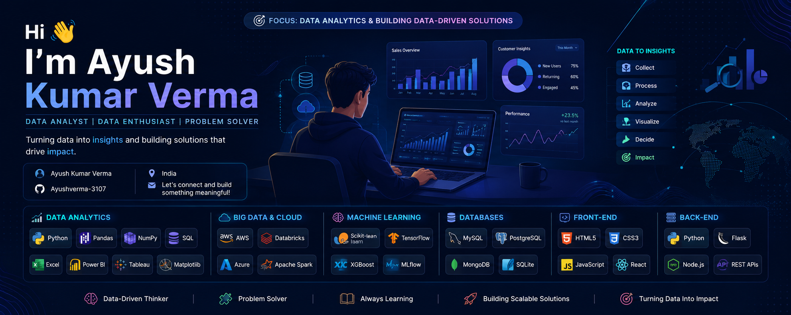

# Hi 👋, I'm Ayush Kumar Verma

  

<h3 align="center">📊 Data Analyst | Data Enthusiast | Problem Solver</h3>

Turning raw data into actionable insights and building data-driven solutions.

---

## 🚀 About Me

* 📊 Currently focused on **Data Analytics & Business Intelligence**
* 🐍 Strong foundation in **Python for Data Analysis**
* ☁️ Exploring **AWS & Databricks**
* 📈 Passionate about transforming data into business insights
* 🧠 Learning **Machine Learning & Predictive Analytics**
* 🌱 Continuously improving my SQL, Visualization, and Cloud skills
* 💡 Open to Data Analyst, BI Analyst, and Data Engineering opportunities

---

## 📊 Data Analytics Stack

---

## ☁️ Big Data & Cloud

---

## 🤖 Machine Learning

---

## 💻 Development Skills

### Frontend

### Backend

---

## 📈 GitHub Stats

  

  

  

---

## 🎯 2026 Goals

* Master Data Analytics & Visualization
* Build End-to-End Analytics Projects
* Gain expertise in Databricks & AWS
* Learn Advanced SQL
* Create Machine Learning Projects
* Contribute to Open Source

---

## 🤝 Connect With Me

* GitHub: https://github.com/Ayushverma-3107
* LinkedIn: https://www.linkedin.com/in/ayush-kumar-verma-842807274/
* Email: ayushkumarv561@gmail.com

---

⭐ Turning Data into Insights | Insights into Decisions | Decisions into Impact
